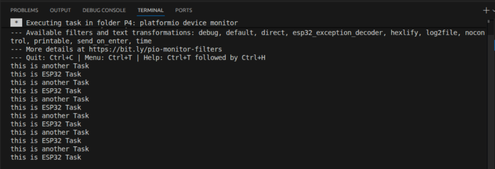
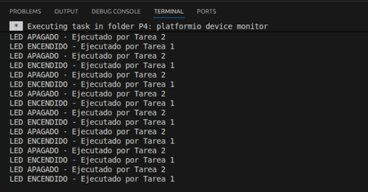
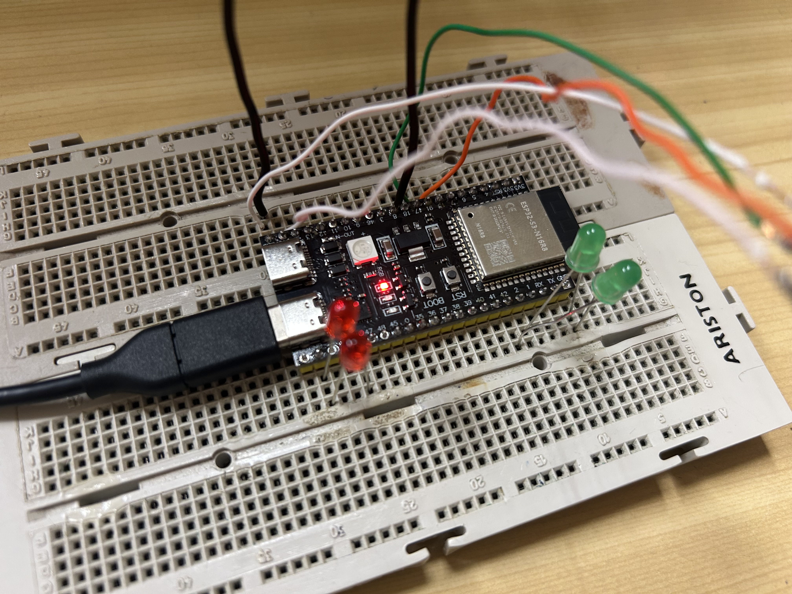
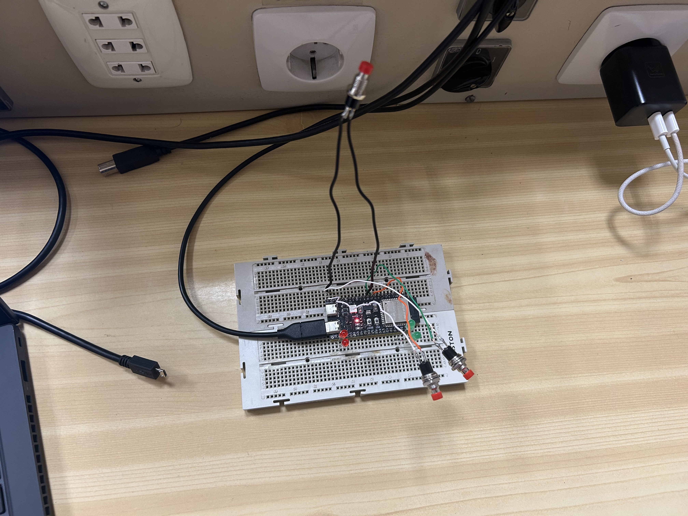
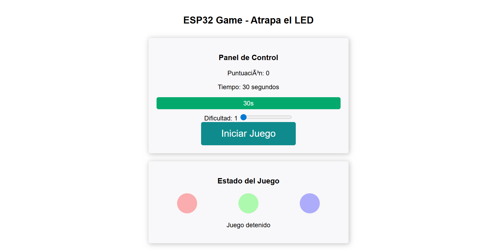

# PRÀCTICA 4: Sistemes Operatius en Temps Real

**Alumne:** Martí Cabanes 

---

## Objectiu

L’objectiu d’aquesta pràctica és entendre el funcionament bàsic d’un sistema operatiu en temps real amb FreeRTOS.

En aquesta pràctica hem creat diferents tasques i hem comprovat com l’ESP32 pot repartir el temps d’execució entre elles. També hem treballat la sincronització entre tasques utilitzant semàfors, cues, interrupcions i mutex.

La pràctica està dividida en quatre parts:

- Exercici 1: creació d’una tasca amb FreeRTOS.
- Exercici 2: dues tasques sincronitzades amb un semàfor.
- Extensió 1: rellotge amb LEDs, botons, cues i mutex.
- Extensió 2: joc amb LEDs, botons i interfície web.

---

# Exercici 1: Creació d’una tasca amb FreeRTOS

## Funcionament

En aquest exercici es crea una tasca addicional amb `xTaskCreate()`. Aquesta tasca s’executa al mateix temps que el `loop()` principal d’Arduino.

El `loop()` imprimeix pel monitor sèrie:

```text
this is ESP32 Task
```

I la tasca creada imprimeix:

```text
this is another Task
```

Com que les dues parts tenen un retard d’aproximadament un segon, els missatges apareixen repetits i intercalats al monitor sèrie.

---

## Sortida pel monitor sèrie

A la sortida del monitor sèrie es pot veure que les dues tasques s’executen de manera contínua.



---

## Codi

El codi complet d’aquest exercici es troba a:

```text
Exercici_1/src/main.cpp
```

---

## Explicació

Aquest exercici serveix per veure que FreeRTOS permet executar més d’una tasca dins de l’ESP32.

Tot i que el `loop()` principal continua funcionant, la tasca `anotherTask` també s’executa en paral·lel. Això fa que el monitor sèrie mostri els dos missatges.

---

# Exercici 2: Tasques sincronitzades amb semàfor

## Funcionament

En aquest exercici s’han creat dues tasques:

- Una tasca encén el LED.
- Una altra tasca apaga el LED.

Per evitar que les dues tasques accedeixin al LED al mateix moment, s’utilitza un semàfor binari.

La funció `xSemaphoreTake()` bloqueja una tasca fins que el semàfor està disponible. Quan la tasca acaba la seva acció, allibera el semàfor amb `xSemaphoreGive()`.

---

## Sortida pel monitor sèrie

Al monitor sèrie es pot veure com les dues tasques actuen sobre el LED:

```text
LED ENCENDIDO - Ejecutado por Tarea 1
LED APAGADO - Ejecutado por Tarea 2
LED ENCENDIDO - Ejecutado por Tarea 1
LED APAGADO - Ejecutado por Tarea 2
```



---

## Vídeo de funcionament

En el següent vídeo es pot veure el LED encenent-se i apagant-se segons les dues tasques sincronitzades.

[Vídeo Exercici 2](ImatgesiVideos_P4/video_ex2.mp4)

---

## Codi

El codi complet d’aquest exercici es troba a:

```text
Exercici_2/src/main.cpp
```

---

## Explicació

Aquest exercici mostra com dues tasques poden compartir un mateix recurs, en aquest cas un LED, sense interferir entre elles.

El semàfor fa que només una tasca pugui actuar sobre el LED en cada moment. Això evita conflictes i permet controlar millor l’ordre d’execució.

També s’utilitza `vTaskDelay()` en lloc de `delay()`, ja que és més adequat en FreeRTOS perquè permet que el planificador executi altres tasques mentre una tasca està esperant.

---

## Pregunta teòrica

**Què passa si s’utilitza una pantalla de tinta electrònica lenta que tarda uns segons a refrescar-se?**

Si el programa no utilitza multitarea, el microcontrolador quedaria bloquejat mentre espera que la pantalla acabi d’actualitzar-se. Durant aquest temps podria deixar de llegir sensors, enviar dades o respondre a altres parts del programa.

Amb FreeRTOS, aquesta actualització es podria fer en una tasca separada. Així, mentre la pantalla s’actualitza, l’ESP32 pot continuar executant altres tasques.

---

# Extensió 1: Rellotge amb LEDs i botons

## Funcionament

En aquesta extensió s’ha creat un petit rellotge utilitzant FreeRTOS.

El programa utilitza diferents tasques:

- Una tasca controla el temps del rellotge.
- Una tasca llegeix els botons.
- Una tasca mostra l’hora pel monitor sèrie.
- Una tasca controla els LEDs.

També s’utilitzen interrupcions per detectar els botons, una cua per guardar els esdeveniments i un mutex per protegir les variables del rellotge.

---

## Comportament del sistema

Quan el programa arrenca, el rellotge comença a comptar des de:

```text
00:00:00
```

El LED dels segons parpelleja segons el pas del temps.

El botó de mode permet canviar entre:

```text
Mode 0: funcionament normal
Mode 1: ajust d’hores
Mode 2: ajust de minuts
```

Quan el sistema està en mode d’ajust, el LED de mode s’encén. El botó d’increment permet modificar les hores o els minuts segons el mode seleccionat.

---

## Vídeo de funcionament

En el següent vídeo es pot veure el LED parpellejant i el funcionament del sistema.

[Vídeo Extensió 1](ImatgesiVideos_P4/video_extensio1.mp4)

---

## Codi

El codi complet d’aquesta extensió es troba a:

```text
Extensio_1/src/main.cpp
```

---

## Explicació

Aquesta extensió aplica més elements de FreeRTOS que els exercicis anteriors.

La cua permet enviar informació dels botons des de la interrupció fins a una tasca. El mutex evita que diverses tasques modifiquin les variables del rellotge al mateix temps.

Això permet tenir un sistema més ordenat i segur, ja que cada tasca té una funció concreta.

---

# Extensió 2: Joc amb LEDs, botons i web

## Funcionament

En aquesta extensió s’ha creat un joc anomenat:

```text
ESP32 Game - Atrapa el LED
```

El joc consisteix a prémer el botó corresponent al LED que està encès. Si es prem el botó correcte, la puntuació augmenta. Si es prem un botó incorrecte, la puntuació pot baixar.

L’ESP32 crea una xarxa WiFi pròpia i mostra una pàgina web des d’on es pot veure l’estat del joc.

---

## Elements utilitzats

- ESP32-S3-DevKitC-1.
- 3 LEDs per al joc.
- 1 LED d’estat.
- 3 botons.
- Resistències.
- Protoboard.
- Cables.

---

## Tasques FreeRTOS utilitzades

El programa utilitza diverses tasques:

- `TareaServidorWeb`: actualitza la informació de la web.
- `TareaJuego`: controla quin LED està actiu.
- `TareaLecturaBotones`: processa els botons premuts.
- `TareaTiempo`: controla el temps restant de joc.

A més, s’utilitzen:

- Interrupcions per detectar els botons.
- Una cua per guardar els esdeveniments dels botons.
- Un mutex per protegir les variables del joc.
- Un servidor web asíncron per mostrar la interfície del joc.

---

## Xarxa WiFi del joc

L’ESP32 crea una xarxa WiFi pròpia amb el nom:

```text
ESP32_Game
```

La contrasenya és:

```text
12345678
```

Un cop connectat el dispositiu a aquesta xarxa, es pot accedir a la web del joc des del navegador utilitzant la IP mostrada pel monitor sèrie.

---

## Evidències del muntatge i funcionament

Foto del muntatge:



Foto del joc funcionant:



Foto de la pàgina web:



---

## Codi

El codi complet d’aquesta extensió es troba a:

```text
Extensio_2/src/main.cpp
```

---

## Explicació

Aquesta extensió combina FreeRTOS amb WiFi i una pàgina web.

El joc funciona gràcies a diverses tasques que s’executen al mateix temps. Una tasca controla el temps, una altra controla el canvi de LEDs, una altra processa els botons i una altra actualitza la web.

El mutex és important perquè diverses tasques accedeixen a variables comunes, com la puntuació, el temps restant o el LED actiu. Sense aquest control, podrien aparèixer errors o dades incoherents.

---

# Conclusions

En aquesta pràctica hem treballat amb FreeRTOS en una ESP32.

En el primer exercici hem vist com es pot crear una tasca addicional que s’executa al mateix temps que el `loop()` principal.

En el segon exercici hem utilitzat un semàfor per sincronitzar dues tasques que comparteixen un mateix LED.

En la primera extensió hem creat un rellotge amb LEDs i botons, utilitzant tasques, interrupcions, cues i mutex.

En la segona extensió hem creat un joc amb LEDs, botons i una interfície web, aplicant diferents elements de FreeRTOS en un projecte més complet.

La pràctica ens ha servit per entendre millor com dividir un programa en tasques i com coordinar-les perquè funcionin correctament.

